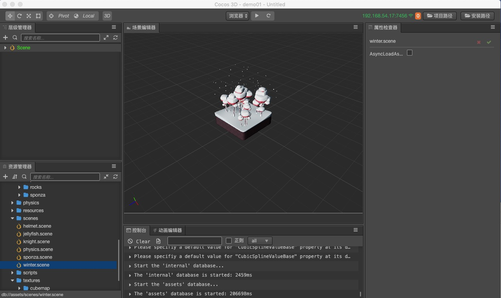

# Editor interface introduction

This chapter will introduce the __editor interface__, familiarize developers with the various panels, menus and buttons that make up the __editor__. The __Cocos Creator 3D__ __editor__ consists of multiple panels, which can be freely moved and customized to suit the needs of different projects and the preferences of developers. The default editor layout will be used as an example to quickly browse the names and functions of the various panels:

## Scene Editor

The **Scene Editor** is a working area for displaying and editing visual content in a __Scene__. The WYSIWYG scene construction work is completed by the display in the __Scene Editor__.

For details, please read the [Scene Editor](scene/index.md) documentation.

## Hierarchy Manager

The **Hierarchy Manager** shows all the nodes in the __Scene__ and their hierarchical relationship is displayed in the form of a __tree view__. All the content in the __Scene Editor__ can be found in the corresponding node entry in the __Hierarchy Manager__. The contents of the two panels will be displayed simultaneously. Generally, we will also use these two panels to build the __Scene__ at the same time.

For more details, please read the [Hierarchy Manager](hierarchy/index.md) documentation.

## Asset Panel

The **Asset Panel** displays all assets in the project asset folder (assets). Here the folders will be displayed in a tree structure and the changes to the contents of the project asset folder in the operating system will be automatically synchronized. You can drag and drop files directly from outside the project, or use the menu to import assets.

For details, please read the [asset Manager] (assets / index.md) section.

## Property inspector

** Property Inspector ** is the work area where we view and edit the properties of the currently selected node and component. This panel will display and edit the attribute data from the script definition in the most suitable form.

For details, please read the [Property Inspector] (inspector / index.md) section.

## Console

** Console ** will display errors, warnings, or log information generated by other editors and engines.

Please read the [Console] (console / index.md) section for details.

## Animation Editor

** Animation Editor ** Can edit and store animation data.

For details, please read the [Familiar with Animation Editor] (../animation/index.md) section.

## Preferences

** Preferences ** provides various personalized global settings for various editors, including native development environment, game preview, and global settings for other plugins.

Please read the [Preferences] (preferences / index.md) section for details.

## Project Settings

** Project Settings ** provides various project-specific personalized settings, including group management, module settings, project preview, custom engine, etc.

For details, please read the [Project Settings] (project / index.md) section.