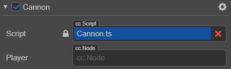
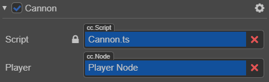

# Access nodes and components

You can modify nodes and components in the **Property Inspector**, or dynamically in a script. The advantage of modifying dynamically is 
that attributes can be continuously modified, either quickly or over a period of time to achieve a gradual effect. Scripts can also respond to player input, and can modify, create, or destroy nodes. Scripts also allow a variety of game logic to be implemented. To achieve these effects, you need to get the node or component you want to modify in the script first.

## Concepts

This document introduces the following concepts:

  - Obtaining the node where the component is located
  - Obtaining other components
  - Use the **Property Inspector** to set-up nodes and components
  - Find child nodes
  - Global node lookup
  - Access values in existing variables

## Obtain the node where the component is located

Obtaining the node where the component is located is as simple as accessing the `this.node` variable in the component method. Example:

```ts
start(){
    let node = this.node;
    node.setPosition(0.0,0.0,0.0);
}
```

## Obtaining other components

It is often required to obtain other components on the same node. Using the `getComponent` API will help find the component. Example:

```ts
import { _decorator, Component, LabelComponent } from "cc";
const { ccclass, property } = _decorator;

@ccclass("test")
export class test extends Component {
    private label: any = null

    start(){
        this.label = this.getComponent(LabelComponent);
        let text = this.name + 'started';
        // Change the text in Label Component
        this.label.string = text;
    }
}
```

You can also pass in a class name to `getComponent`. For user-defined components, the class name is the file name of the script, and is **case sensitive**. For example, the component declared in __SinRotate.ts__, the class name is __SinRotate__. Example:

```ts
let rotate = this.getComponent("SinRotate");
```

`getComponent` is also available from a node. It works exactly the same. Example:

```ts
start() {
    console.log( this.node.getComponent(LabelComponent) === this.getComponent(LabelComponent) );  // true
}
```

If a component cannot be found on a node, `getComponent` will return __null__. Accessing the value of __null__, it will throw a __TypeError__ error at runtime. To decide whether a component exists, please do a sanity check. Example:

```ts
import { _decorator, Component, LabelComponent } from "cc";
const { ccclass, property } = _decorator;

@ccclass("test")
export class test extends Component {
    private label: any =null;

    start() {
        this.label = this.getComponent(LabelComponent);
        if (this.label) {
            this.label.string = "Hello";
        }
        else {
            console.error("Something wrong?");
        }
    }
}
```

## Obtaining other nodes and their components

It is usually not enough to only be able to access the node's own components. Scripts usually need to interact between multiple nodes. For example, a cannon that automatically targets a player needs to constantly obtain the latest position of the player. __Cocos Creator 3D__ provides some different methods to obtain other nodes and/or other components.

### Setting a node using Property Inspector

The most direct way is to set the object you need in the **Property Inspector**. Taking the node as an example, this only needs to declare an attribute of type `Node` in the script. Example:

```ts
// Cannon.ts

import { _decorator, Component, Node } from "cc";
const { ccclass, property } = _decorator;

@ccclass("Cannon")
export class Cannon extends Component {
    // Declare Player attribute
    @property({type:Node})
    private player = null;
}
```

This code declares a `player` property in `properties` with a default value of __null__, and specifies its object type as type `Node`. This is equivalent to declaring `public Node player = null;` in other languages. After the script is compiled, this component looks like this in the **Property Inspector**:



Then, you can drag any node on the __Hierarchy Manager__ to this `Player` control.



In this way, the `player` property will be set successfully, and can be accessed directly in the script. Example:

```ts
// Cannon.ts

import { _decorator, Component, Node } from "cc";
const { ccclass, property } = _decorator;

@ccclass("Cannon")
export class Cannon extends Component {

    @property({type:Node})
    private player = null;

    start() {
        console.log("The player is " + this.player.name);
    }
}
```

### Using the Property Inspector to set a Component

In the above example, if you declare the type of the property as the `Player` component, when you drag the __Player Node__ to the **Property Inspector**, the `Player` property will be set to the `Player` component in this node. It is then not necessary to call `getComponent` yourself. Example:

```ts
// Cannon.ts

import { _decorator, Component } from "cc";
const { ccclass, property } = _decorator;
import { Player } from "Player";

@ccclass("Cannon")
export class Cannon extends Component {
    @property({type:Player})
    private player = null;

    start(){
        let PlayerComp = this.player;
    }
}
```

Tthe default value of an attribute can be changed from `null` to an array `[]`. This allows setting multiple objects in the **Property Inspector** at the same time. However, if you need to dynamically obtain other objects at runtime, you also need to use the search method described below.

### Finding child nodes

Sometimes, there are many objects of the same type in the game scene, such as turrets, enemies, and special effects. Usually a global script manages them uniformly. If the **Property Inspector** is used to associate them one by one with this script, the work will be tedious. In-order to better manage these objects in a unified way, they can be placed under a unified parent object. Then all of the child objects can be obtained through the parent object. Example:

```ts
// CannonManager.ts

import { _decorator, Component, Node } from "cc";
const { ccclass, property } = _decorator;

@ccclass("CannonManager")
export class CannonManager extends Component {

    start() {
        let cannons = this.node.children;
        //...
    }

}
```

`getChildByName` can also be used. Example:

```ts
this.node.getChildByName("Cannon 01");
```

如果子节点的层次较深，你还可以使用 `find`，`find` 将根据传入的路径进行逐级查找：

```ts
find("Cannon 01/Barrel/SFX", this.node);
```

### 全局名字查找

当 `find` 只传入第一个参数时，将从场景根节点开始逐级查找：

```ts
this.backNode = find("Canvas/Menu/Back");
```

## 访问已有变量里的值

如果你已经在一个地方保存了节点或组件的引用，你也可以直接访问它们

### 通过模块访问

你可以使用 `import` 来实现脚本的跨文件操作，让我们看个示例：

```ts
// Global.ts, now the filename matters
import { _decorator, Component, Node } from "cc";
const { ccclass, property } = _decorator;

@ccclass("Global")
export class Global extends Component {

    public static backNode:any=null;
    public static backLabel:any=null;
}
```

每个脚本都能用 `import{ } from` + 文件名(不含路径) 来获取到对方 exports 的对象。

```ts
// Back.ts
import { _decorator, Component, Node, LabelComponent } from "cc";
const { ccclass, property } = _decorator;
// this feels more safe since you know where the object comes from
import{Global}from "./Global";

@ccclass("Back")
export class Back extends Component {
    onLoad(){
        Global.backNode=this.node;
        Global.backLabel=this.getComponent(LabelComponent);
    }
}
```

```ts
// AnyScript.ts
import { _decorator, Component, Node } from "cc";
const { ccclass, property } = _decorator;
// this feels more safe since you know where the object comes from
import{Global}from "./Global";

@ccclass("AnyScript")
export class AnyScript extends Component {
    start () {
        var text = "Back";
        Global.backLabel.string=text;
    }
}
```
---

继续前往 [常用节点和组件接口](basic-node-api.md)。
